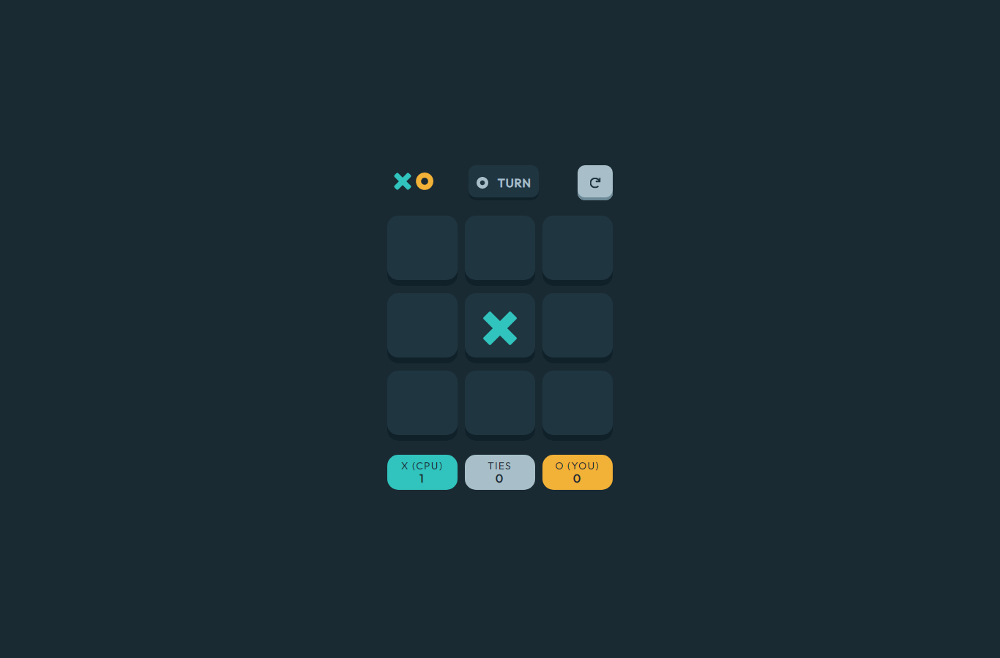
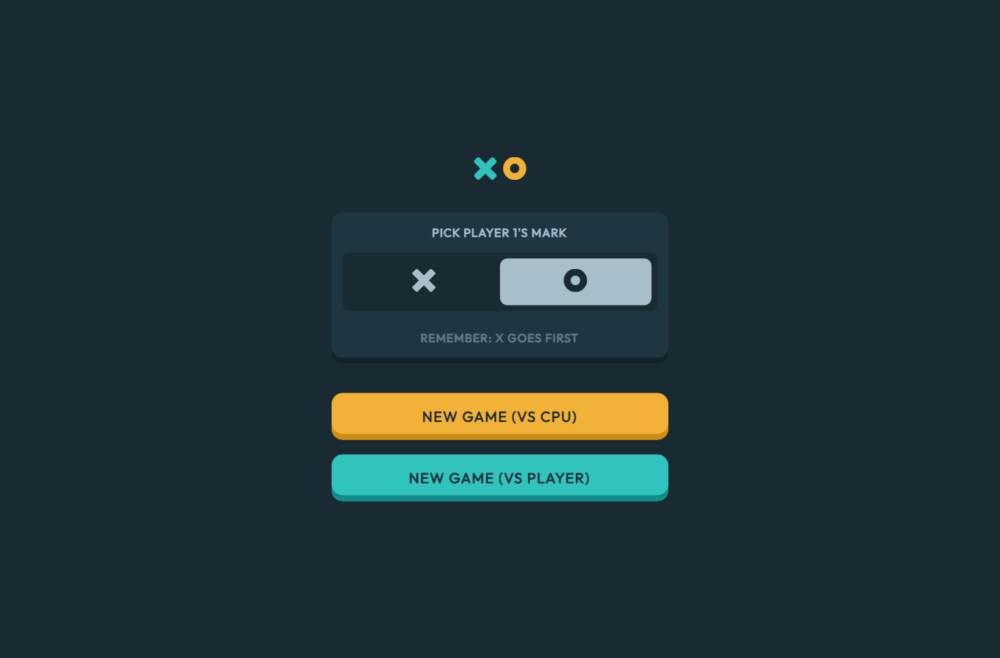
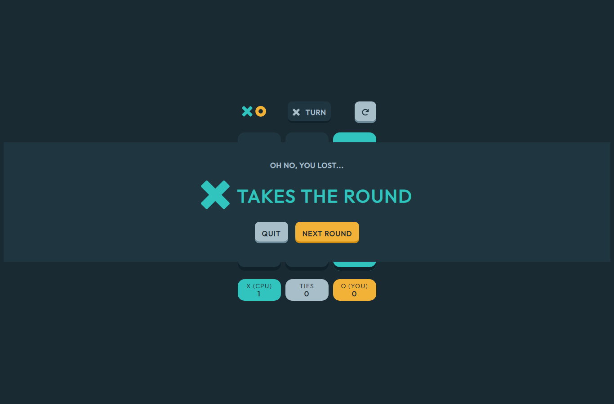
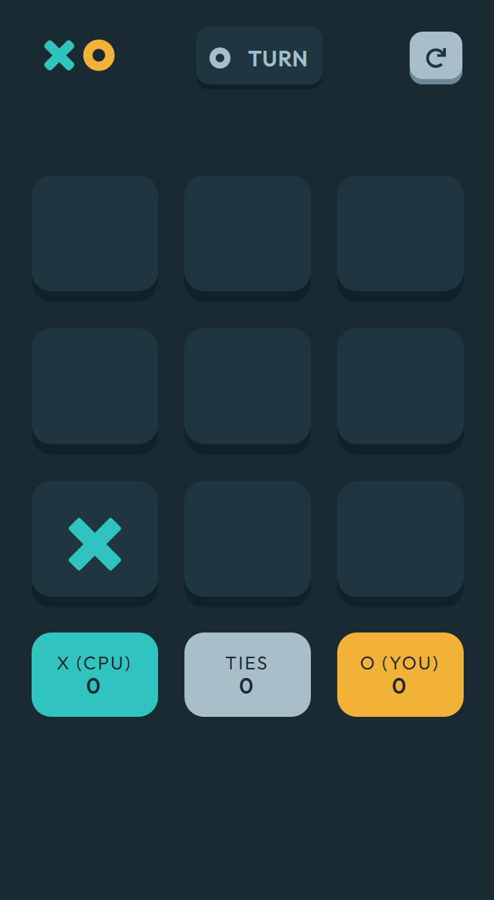
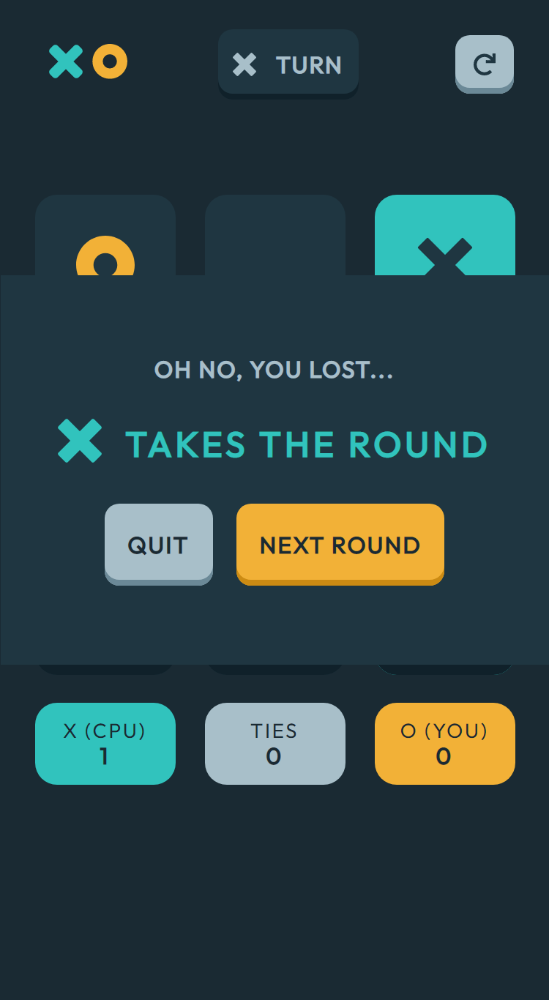
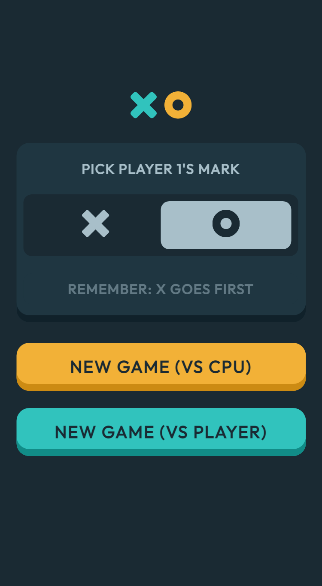
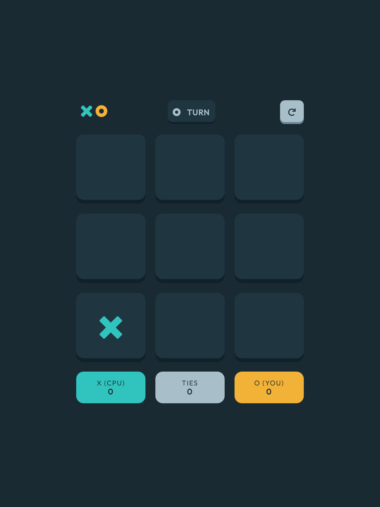
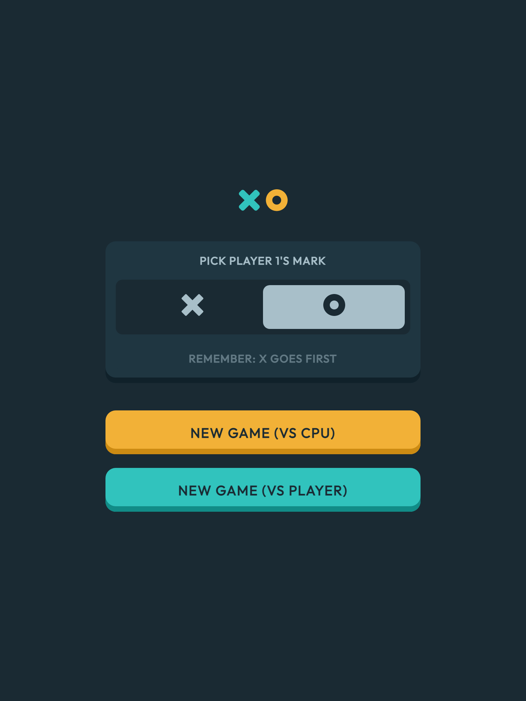
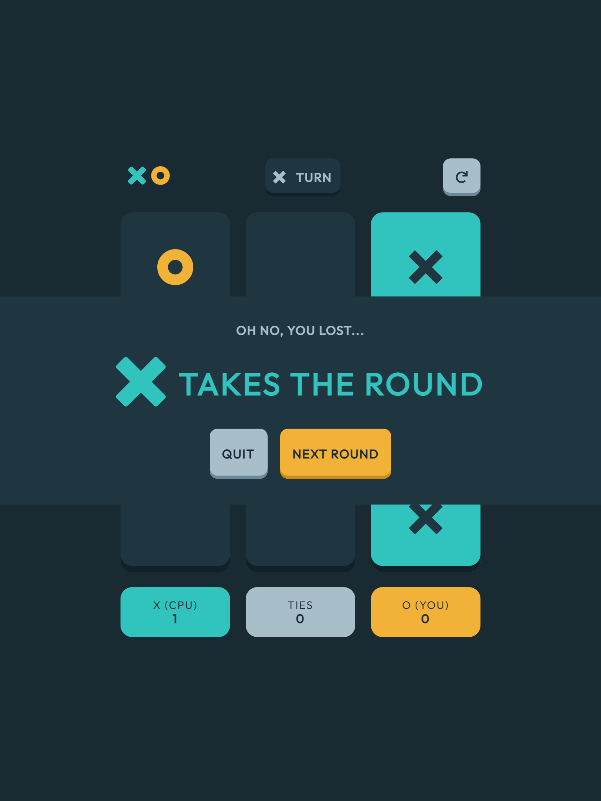

# Frontend Mentor - Tic Tac Toe solution

This is a solution to the [Tic Tac Toe challenge on Frontend Mentor](https://www.frontendmentor.io/challenges/tic-tac-toe-game-Re7ZF_E2v). Frontend Mentor challenges help you improve your coding skills by building realistic projects. 

## Table of contents

- [Overview](#overview)
  - [The challenge](#the-challenge)
  - [Screenshot](#screenshot)
  - [Links](#links)
- [My process](#my-process)
  - [Built with](#built-with)
  - [What I learned](#what-i-learned)
  - [Continued development](#continued-development)
  - [Useful resources](#useful-resources)
- [Author](#author)

**Note: Delete this note and update the table of contents based on what sections you keep.**

## Overview

### The challenge

Users should be able to:

- View the optimal layout for the game depending on their device's screen size
- See hover states for all interactive elements on the page
- Play the game either solo vs the computer or multiplayer against another person
- **Bonus 1**: Save the game state in the browser so that it’s preserved if the player refreshes their browser
- **Bonus 2**: Instead of having the computer randomly make their moves, try making it clever so it’s proactive in blocking your moves and trying to win

Note: Bonus 1 wasn't acheived but Bonus 2 was acheived.

### Screenshot

### Links

- Solution URL: [Add solution URL here](https://your-solution-url.com)
- Live Site URL: [https://tictactoe-vert-chi.vercel.app/index.html]

## My process

### Built with

- Flexbox
- CSS Grid
- Javascript

### What I learned

I learnt how to solve more  complicated logic that usually occurs in building games

### Continued development

I would like to continue developing my Javascript skills so that I can simplify the code where neccesary 

**Note: Delete this note and the content within this section and replace with your own plans for continued development.**

### Useful resources

- [Stack Overflow](https://www.stackoverflow.com) - This helped me in a various number of ways, especially when i get stuck. 

## Author

- Frontend Mentor - [@faruking](https://www.frontendmentor.io/profile/faruking)
- Twitter - [@faruking2](https://www.twitter.com/faruking2)
